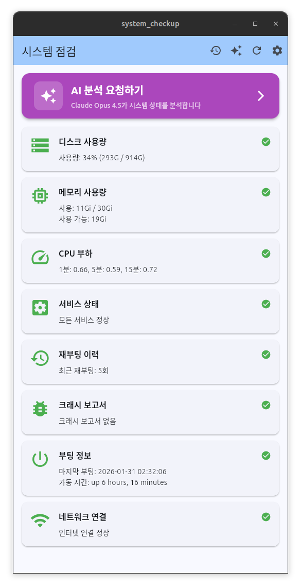
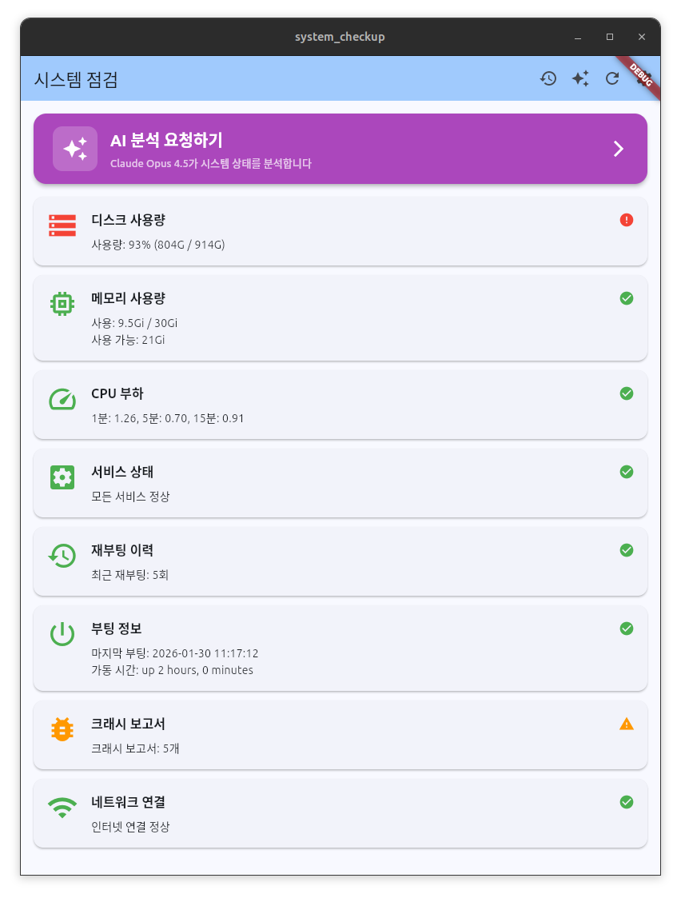

# System Checkup 🔍

[English](#english) | [한국어](#korean)

---

<a name="english"></a>

# Linux System Checkup with AI Analysis

[](https://github.com/hongsw/system-checkup/releases)
[](https://flutter.dev)
[](LICENSE)
[](CONTRIBUTING.md)

A beautiful Linux desktop application for system monitoring with AI-powered analysis using Claude Opus 4.5.

> **🚀 Looking for Contributors!** We welcome contributions of all kinds. See [CONTRIBUTING.md](CONTRIBUTING.md) for details.

## 📸 Screenshots

### Main System Checkup


### AI Analysis Results


### Detailed AI Report


### Analysis History


## ✨ Features

### 🔍 System Monitoring (8 Items)
- **Boot Information** - Last boot time and uptime
- **Disk Usage** - Storage usage with warnings (>90% red alert)
- **Memory Usage** - RAM and SWAP status
- **CPU Load** - 1/5/15 minute averages
- **Service Status** - Failed systemd services detection
- **Network Connection** - Internet connectivity check
- **Crash Reports** - System crash report monitoring
- **Reboot History** - Recent reboot records

### 🤖 AI Analysis (Claude Opus 4.5)
- **Intelligent Analysis** - Claude Opus 4.5 powered system analysis
- **Markdown View** - Beautiful formatted results
- **Actionable Advice** - Specific commands and solutions
- **Custom Prompts** - Customize analysis style

### 📊 History Management
- **Date Grouping** - Organized by "Today", "Yesterday", etc.
- **Auto-save** - Up to 50 analysis histories
- **Detail View** - Review past analysis anytime
- **Easy Management** - Individual/bulk deletion

### 🔒 Security
- **Secure Storage** - API keys encrypted with Linux keyring (libsecret)
- **Auto-save** - Settings saved automatically

## 🚀 Quick Start

**Choose your installation method:**

- 🏃 **Run directly** - Quick test without installation
- 📱 **Application menu** - Install as a clickable desktop app (Recommended)
- ⚙️ **Auto-start service** - Launch automatically on login

### Prerequisites

```bash
# Install Flutter development tools
sudo apt install -y clang cmake ninja-build pkg-config libgtk-3-dev

# Install security storage library
sudo apt install -y libsecret-1-dev
```

### Install Flutter

```bash
# Download Flutter SDK
cd ~
wget https://storage.googleapis.com/flutter_infra_release/releases/stable/linux/flutter_linux_3.27.3-stable.tar.xz
tar xf flutter_linux_3.27.3-stable.tar.xz

# Add to PATH
echo 'export PATH="$HOME/flutter/bin:$PATH"' >> ~/.bashrc
source ~/.bashrc
```

### Run the Application

```bash
# Clone repository
git clone https://github.com/hongsw/system-checkup.git
cd system_checkup

# Install dependencies
flutter pub get

# Run on Linux
flutter run -d linux

# Build release
flutter build linux
```

### Install to Application Menu (Click to Run)

```bash
# Build release first
flutter build linux --release

# Install to application menu
./install-desktop.sh
```

After installation, you can search for "System Checkup" in your **Applications Menu** and run it with a click.

**To uninstall:**
```bash
./uninstall-desktop.sh
```

### Install as systemd Service (Auto-start on Login)

```bash
# Install service
./system-checkup-manage.sh install

# Check status
./system-checkup-manage.sh status

# See all available commands
./system-checkup-manage.sh help
```

**Management Commands:**
- `status` - Check service status
- `start/stop/restart` - Control service
- `enable/disable` - Auto-start on/off
- `logs` - View real-time logs
- `rebuild` - Rebuild and restart
- `uninstall` - Remove service

See [SYSTEMD_SETUP.md](SYSTEMD_SETUP.md) for details.

## ⚙️ Configuration

### Get Claude API Key

1. Visit [Anthropic Console](https://console.anthropic.com)
2. Create an API key
3. Open the app and click **Settings (⚙️)**
4. Enter your API key (auto-saved)
5. Customize prompt (optional)

## 📖 Usage

### Basic Workflow

1. **Launch app** → Auto system checkup
2. **Click purple button** → "Request AI Analysis"
3. AI analyzes with Claude Opus 4.5
4. **View results** in markdown format
5. **Check history (🕐)** for past analyses

### UI Navigation

#### Main Screen (Top Bar)
- 🕐 **History** - View analysis history
- ⭐ **AI Analysis** - New analysis
- 🔄 **Refresh** - Re-check system
- ⚙️ **Settings** - API key & prompts

#### History Screen
- Date-grouped analysis list
- Status-colored indicators (Normal/Warning/Error)
- Individual/bulk deletion

## 🛠️ Tech Stack

- **Framework**: Flutter 3.27.3
- **Language**: Dart 3.6.1
- **AI Model**: Claude Opus 4.5
- **Key Packages**:
  - `http` - API communication
  - `flutter_secure_storage` - Secure key storage
  - `shared_preferences` - Settings management
  - `flutter_markdown` - Markdown rendering

## 🤝 Contributing

We're looking for contributors! Here's how you can help:

### Ways to Contribute
- 🐛 **Bug Reports** - Found a bug? Open an issue!
- 💡 **Feature Requests** - Have ideas? We'd love to hear!
- 📸 **Screenshots** - Help us add more beautiful screenshots
- 🌍 **Translations** - Add more language support
- 📝 **Documentation** - Improve docs and guides
- 💻 **Code** - Submit pull requests

### Getting Started

1. Fork the repository
2. Create your feature branch (`git checkout -b feature/AmazingFeature`)
3. Commit your changes (`git commit -m 'Add some AmazingFeature'`)
4. Push to the branch (`git push origin feature/AmazingFeature`)
5. Open a Pull Request

See [CONTRIBUTING.md](CONTRIBUTING.md) for detailed guidelines.

## 📝 Development

This project was developed through **11 iterative prompts** using Claude Code. See [DEVELOPMENT.md](DEVELOPMENT.md) for the complete development process.

## 🗺️ Roadmap

### 🎯 High Priority

- [ ] **Security Monitoring** (v2.0 planned)
  - Intrusion detection: Failed logins, sudo logs, file modifications
  - Network security: Firewall status, open ports, SSH config
  - AI-powered security analysis with threat detection
  - See [SPEC.md](SPEC.md) for detailed security check specifications
- [ ] **Cross-platform support** (Windows/macOS)
  1. Implement platform-specific system check commands
     - Windows: PowerShell, `wmic`, `systeminfo`
     - macOS: `sysctl`, `diskutil`, `launchctl`
  2. Add Windows/macOS builds
- [ ] Auto-refresh functionality
- [ ] System notifications

### 🌟 Future Enhancements

- [ ] Dark mode support
- [ ] Multiple AI model selection (GPT-4, Gemini, etc.)
- [ ] PDF report export
- [ ] Multi-language support (more languages)
- [ ] Mobile support (Android/iOS)

## 📄 License

MIT License - see [LICENSE](LICENSE) file for details

## 🙏 Acknowledgments

- [Anthropic](https://www.anthropic.com) - Claude API
- [Flutter Team](https://flutter.dev) - Amazing framework
- Linux Community
- All contributors

## 📧 Contact

- Issues: [GitHub Issues](https://github.com/hongsw/system-checkup/issues)
- Discussions: [GitHub Discussions](https://github.com/hongsw/system-checkup/discussions)

---

<a name="korean"></a>

# 한국어 가이드

Linux 시스템 점검 및 AI 분석 GUI 애플리케이션입니다.

> **🚀 컨트리뷰터를 찾고 있습니다!** 모든 종류의 기여를 환영합니다. 자세한 내용은 [CONTRIBUTING.md](CONTRIBUTING.md)를 참조하세요.

## 📸 스크린샷

### 메인 시스템 점검 화면


### AI 분석 결과


### 상세 AI 리포트


### 분석 이력


## ✨ 주요 기능

### 🔍 시스템 점검 (8가지 항목)
- **부팅 정보** - 마지막 부팅 시간, 가동 시간
- **디스크 사용량** - 사용률 경고 (90% 이상 빨간색)
- **메모리 사용량** - RAM 및 SWAP 상태
- **CPU 부하** - 1분/5분/15분 평균
- **서비스 상태** - 실패한 systemd 서비스
- **네트워크 연결** - 인터넷 연결 상태
- **크래시 보고서** - 시스템 크래시 확인
- **재부팅 이력** - 최근 재부팅 기록

### 🤖 AI 분석 (Claude Opus 4.5)
- **지능형 분석** - Claude Opus 4.5 기반
- **마크다운 뷰** - 보기 좋은 결과 표시
- **구체적 조언** - 실행 가능한 명령어 제공
- **프롬프트 커스터마이징** - 분석 방식 수정 가능

### 📊 이력 관리
- **날짜별 정리** - "오늘", "어제" 등으로 그룹화
- **자동 저장** - 최대 50개 이력 저장
- **상세 보기** - 과거 분석 결과 확인
- **간편 관리** - 개별/전체 삭제

### 🔒 보안
- **안전한 저장** - Linux keyring으로 API 키 암호화
- **자동 저장** - 설정 자동 저장

## 🚀 빠른 시작

**설치 방법을 선택하세요:**

- 🏃 **바로 실행** - 설치 없이 빠른 테스트
- 📱 **응용프로그램 메뉴** - 클릭으로 실행하는 데스크톱 앱으로 설치 (권장)
- ⚙️ **자동 시작 서비스** - 로그인 시 자동으로 실행

### 사전 요구사항

```bash
# Flutter 개발 도구 설치
sudo apt install -y clang cmake ninja-build pkg-config libgtk-3-dev

# 보안 저장소 라이브러리
sudo apt install -y libsecret-1-dev
```

### Flutter 설치

```bash
# Flutter SDK 다운로드
cd ~
wget https://storage.googleapis.com/flutter_infra_release/releases/stable/linux/flutter_linux_3.27.3-stable.tar.xz
tar xf flutter_linux_3.27.3-stable.tar.xz

# PATH 추가
echo 'export PATH="$HOME/flutter/bin:$PATH"' >> ~/.bashrc
source ~/.bashrc
```

### 앱 실행

```bash
# 저장소 클론
git clone https://github.com/hongsw/system-checkup.git
cd system_checkup

# 의존성 설치
flutter pub get

# Linux에서 실행
flutter run -d linux

# 릴리즈 빌드
flutter build linux
```

### 응용프로그램 메뉴에 설치 (클릭으로 실행)

```bash
# 릴리즈 빌드 먼저 필요
flutter build linux --release

# 응용프로그램 메뉴에 설치
./install-desktop.sh
```

설치 후 **응용프로그램 메뉴**에서 "System Checkup" 또는 "시스템 점검"을 검색하여 실행할 수 있습니다.

**제거 방법:**
```bash
./uninstall-desktop.sh
```

### systemd 서비스로 설치 (로그인 시 자동 시작)

```bash
# 서비스 설치
./system-checkup-manage.sh install

# 상태 확인
./system-checkup-manage.sh status

# 모든 명령어 보기
./system-checkup-manage.sh help
```

**관리 명령어:**
- `status` - 서비스 상태 확인
- `start/stop/restart` - 서비스 제어
- `enable/disable` - 자동 시작 켜기/끄기
- `logs` - 실시간 로그 보기
- `rebuild` - 다시 빌드하고 재시작
- `uninstall` - 서비스 제거

자세한 내용은 [SYSTEMD_SETUP.md](SYSTEMD_SETUP.md)를 참조하세요.

## ⚙️ 설정

### Claude API 키 발급

1. [Anthropic Console](https://console.anthropic.com) 방문
2. API 키 생성
3. 앱 실행 후 **설정 아이콘(⚙️)** 클릭
4. API 키 입력 (자동 저장됨)
5. 프롬프트 수정 (선택사항)

## 📖 사용 방법

### 기본 사용 흐름

1. **앱 실행** → 시스템 자동 점검
2. **보라색 버튼** 클릭 → "AI 분석 요청하기"
3. Claude Opus 4.5로 분석
4. **마크다운 형식**으로 결과 확인
5. **이력 버튼(🕐)** 으로 과거 분석 확인

### 화면 구성

#### 메인 화면 (상단 버튼)
- 🕐 **이력** - 분석 이력 보기
- ⭐ **AI 분석** - 새로운 분석
- 🔄 **새로고침** - 시스템 재점검
- ⚙️ **설정** - API 키 및 프롬프트

#### 이력 화면
- 날짜별 그룹화된 분석 목록
- 상태별 색상 표시 (정상/경고/오류)
- 개별/전체 삭제 기능

## 🤝 기여하기

컨트리뷰터를 찾고 있습니다! 다음과 같이 도와주실 수 있습니다:

### 기여 방법
- 🐛 **버그 리포트** - 버그를 발견하셨나요? 이슈를 열어주세요!
- 💡 **기능 제안** - 아이디어가 있으신가요? 알려주세요!
- 📸 **스크린샷** - 더 많은 멋진 스크린샷 추가를 도와주세요
- 🌍 **번역** - 다양한 언어 지원 추가
- 📝 **문서화** - 문서와 가이드 개선
- 💻 **코드** - Pull Request 제출

### 시작하기

1. 저장소 포크
2. 기능 브랜치 생성 (`git checkout -b feature/멋진기능`)
3. 변경사항 커밋 (`git commit -m '멋진 기능 추가'`)
4. 브랜치에 푸시 (`git push origin feature/멋진기능`)
5. Pull Request 오픈

자세한 가이드는 [CONTRIBUTING.md](CONTRIBUTING.md)를 참조하세요.

## 📝 개발 과정

이 프로젝트는 Claude Code를 사용하여 **11개의 프롬프트**를 통해 개발되었습니다. 전체 개발 과정은 [DEVELOPMENT.md](DEVELOPMENT.md)를 참조하세요.

## 🗺️ 로드맵

### 🎯 우선순위 높음

- [ ] **보안 모니터링** (v2.0 계획)
  - 침투 탐지: 로그인 실패 기록, sudo 로그, 파일 변경 감지
  - 네트워크 보안: 방화벽 상태, 열린 포트, SSH 설정
  - AI 기반 보안 분석 및 위협 탐지
  - 자세한 보안 점검 사양은 [SPEC.md](SPEC.md) 참조
- [ ] **크로스 플랫폼 지원** (Windows/macOS)
  1. 플랫폼별 시스템 점검 명령어 구현
     - Windows: PowerShell, `wmic`, `systeminfo`
     - macOS: `sysctl`, `diskutil`, `launchctl`
  2. Windows/macOS 빌드 추가
- [ ] 자동 새로고침
- [ ] 시스템 알림

### 🌟 향후 개선 사항

- [ ] 다크 모드
- [ ] 여러 AI 모델 선택 (GPT-4, Gemini 등)
- [ ] PDF 보고서 내보내기
- [ ] 다국어 지원 (더 많은 언어)
- [ ] 모바일 지원 (Android/iOS)

## 📄 라이선스

MIT License - 자세한 내용은 [LICENSE](LICENSE) 파일 참조

## 🙏 감사의 말

- [Anthropic](https://www.anthropic.com) - Claude API 제공
- [Flutter Team](https://flutter.dev) - 훌륭한 프레임워크
- Linux 커뮤니티
- 모든 기여자분들

## 📧 연락처

- 이슈: [GitHub Issues](https://github.com/hongsw/system-checkup/issues)
- 토론: [GitHub Discussions](https://github.com/hongsw/system-checkup/discussions)

---

**⭐ 이 프로젝트가 도움이 되셨다면 Star를 눌러주세요!**

**We're looking for contributors!** | **컨트리뷰터를 찾고 있습니다!**
